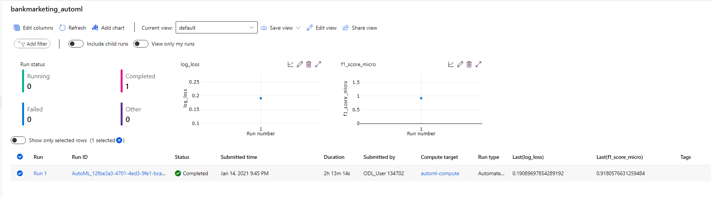
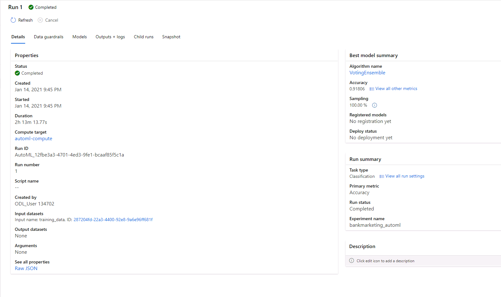
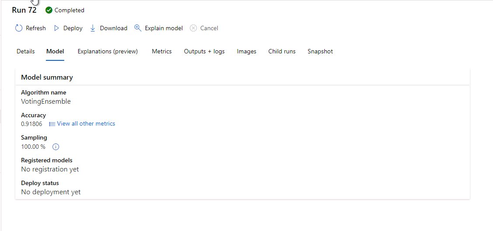
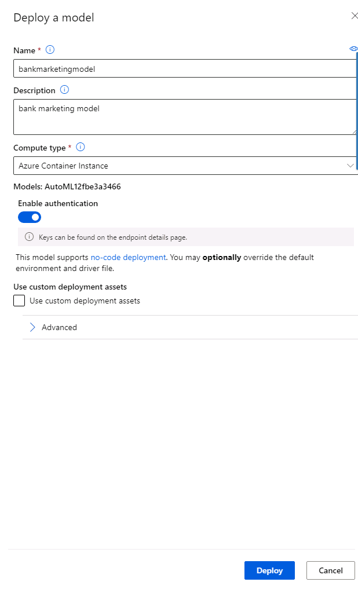
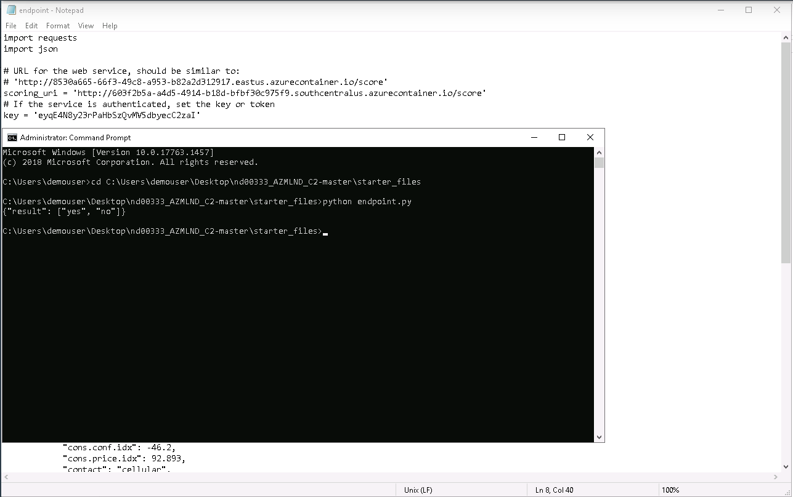
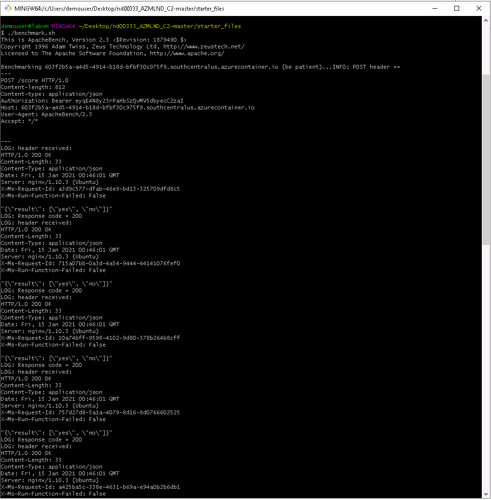
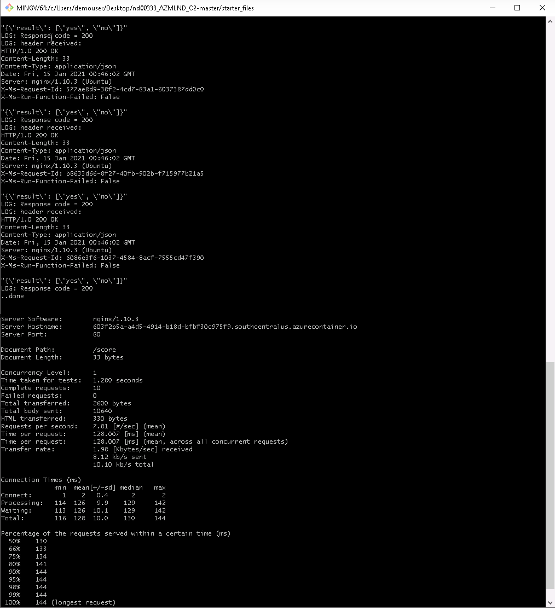
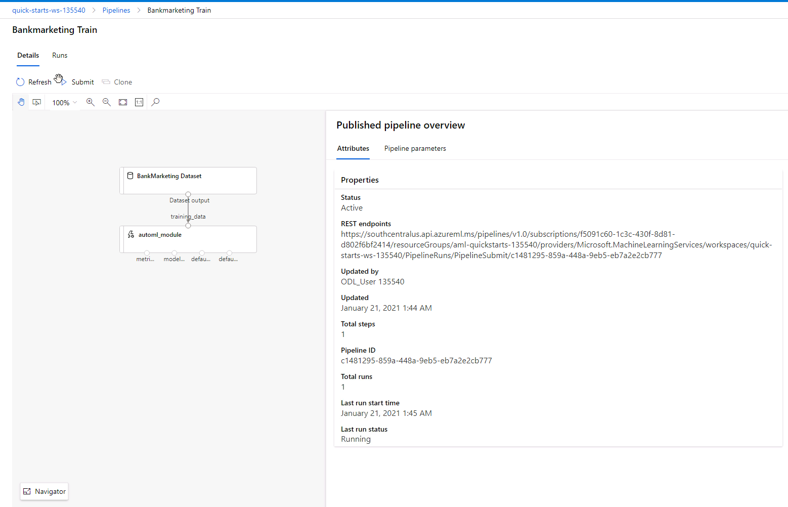
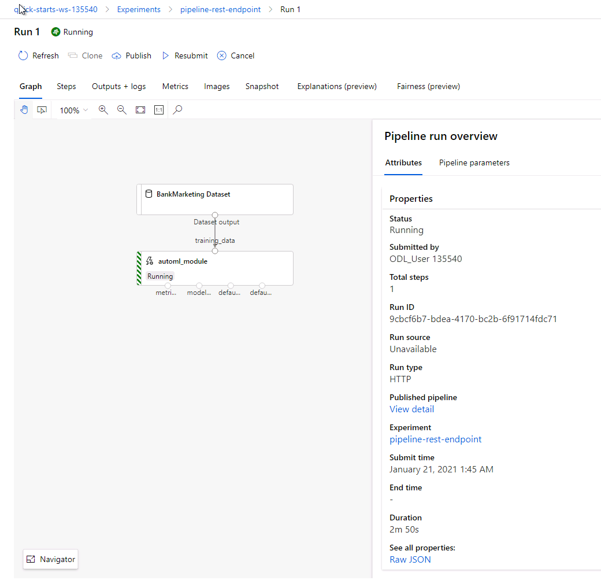

# Operationalizing Machine Learning in Azure
## Overview
This project is part of the Udacity Azure ML Nanodegree. In this project, we build and operationalize an Azure ML pipeline using Azure Machine Learning Studio and Azure ML Notebooks with Python SDK. 

In Azure Machine Learning Studio, an AutoML run is configured for the given dataset. The AutoML Run identifies the best model using a defined metric such as accuracy or AUC ..etc. The best model is then deployed to Azure Container Instances(ACI) or Azure Kubernetes Instances(AKI). The deployment creates an endpoint, which can be inspected using Swagger. The endpoint can be managed using Python SDK. 

Using Azure ML Python SDK, an ML pipeline can be built, deploy, and consume in Azure ML notebooks. An AutoML run is configured using SDK and the AutoML run identifies the best model. Deploying the model creates an HTTP service, which can be consumed by clients. The service endpoints can be managed using SDK. The endpoint can be inspected using swagger to understand the signature of the service and its request and response structures.

## Dataset Summary
The dataset contains data about a marketing compaign of a bank. The label indicates whether the customer subscribed after the campaign. The goal is to build a classification model that predicts if the client will subscribe or not.  The data contains demographic information of the client such as age, job, marital status and education along with financial information such as housing, loan. Each record for the customer contains information related to participation in previous campaigns, when he was last contacted ..etc.

## Architectural Diagram
The lifecycle of a machine learning model involves data acquisition, data preparation, hypothesis and model development, model evaluation, model deployment, operations and optimization of the model. Azure Machine Learning uses DevOps based MLOps(Machine Learning Operations) approach for machine learning workflows. MLOps applies continuous integration, delivery and deployment to the machine learning process. 

An Azure ML pipeline contains steps from data preparation to feature extraction to hyperparameter tuning to model evaluation. The Azure ML pipelines can be built, deployed, and managed using Azure Machine Learning Studio UI. The Azure ML pipelines can be built, deployed, and managed using Azure ML SDK.

When a model has been deployed as a web service, the endpoint can be deployed on Azure container Instances, Azure Kubernetes Services, or FPGAs. When a trained model is deployed, a real-time endpoint is created. Real-time endpoints receive a single request via the REST endpoint and return a prediction. Pipeline endpoints expose ML pipelines programmatically via a REST endpoint. Pipeline endpoints can be used to automate the pipeline works flows. 

## Key Steps
### Using Machine Learning Studio UI

Azure ML uses datasets to refer to the data stored in a datastore. The dataset can be created and perform data exploration before starting the Model development. Using Azure ML studio, the dataset can also be created during the AutoML configuration. The following screenshot shows the bank marketing dataset created during the AutoML configuration using Azure Machine learning Studio.

Using Azure Machine Learning Studio, an AutoML experiment can be started by selecting the AutoML and then configuring the type of machine learning and the dataset. The following screenshot shows the AutoML run and its status.

The following screenshot shows the details of the AutoML experiment. The AutoML run identifies Votingensemble as the best algorithm and the corresponding metric (accuracy: 0.91806). 

The following screenshot shows the details of the Voting Ensemble model run.

In Azure Machine Learning Studio, the best model can be deployed using the "Deploy" button on the model details of the above screenshot. Compute type and authentication can be configured during the deployment. The following screenshot shows the details of deploying a model.

Once the model is deployed, a REST endpoint is available for consumption. The following screenshot shows the deployment during the transitioning phase of the deployment.

The endpoints can be monitored using Python SDK. For example, the following screen shows a python script that queries the logs of the endpoint. 

The REST endpoint can be inspected using swagger. Once the endpoint is deployed, Azure provides a Swagger JSON file, which can be used to host a web server for metadata for the endpoint. The following screenshot shows Swagger UI showing details of the model.

Inspecting the methods on the Swagger UI shows the details of the web service methods and their request and response signatures.

The REST endpoints can be consumed using Python Code. The following screenshot shows the results of calling REST endpoint using Python code.

The endpoints can be benchmarked using ApacheBench.The following two screenshots show the detail of a benchmarking test.

### Pipelines
An Azure Machine learning pipeline is a workflow of machine learning tasks. Pipeline tasks are a series of steps. Pipelines contain re-usable pipeline steps. Machine Learning pipelines can be used to create and manage workflows. Using Azure Notebooks, an AutoML experiment can be created by submitting a pipeline with AutoML steps. The following screenshot shows the pipeline run and its status.

The details of the pipelines contain the steps in the pipeline. The Graph shows the steps in the pipeline.

Using SDK, The datasets can be created and registered with Azure ML. The following screenshot shows the dataset created by the notebook.

After submitting the pipeline for a run, the RunDetails method shows the details of the run in the notebook.

By calling the wait_for_completion method, the notebook waits for the pipeline run to completion and shows the details of the run. The following screenshot shows the run with completed status.

The pipeline can be published using SDK. The following screenshot shows the published pipeline.

The following screenshot shows the published endpoint.

The endpoint run can be examined in Azure Machine Learning Studio. The following screenshot shows the pipeline runs.

The following screenshot shows the details of the pipeline run.

The following screenshot shows the details of the pipeline run after completion.

## Screen Recording
[Screencast](https://drive.google.com/file/d/1X9JslMAEKfLaEHGxLFgfzSk5bZplCSfd/view?usp=sharing)

## Standout Suggestions
The AutoML dataguard feature indicates that the data is imbalanced. the smallest class has 3692 rows whereas the dataset contains 32950. Using undersampling or oversampling can improve the performance.

By including deep learning in AutoML, models may provide better results.

