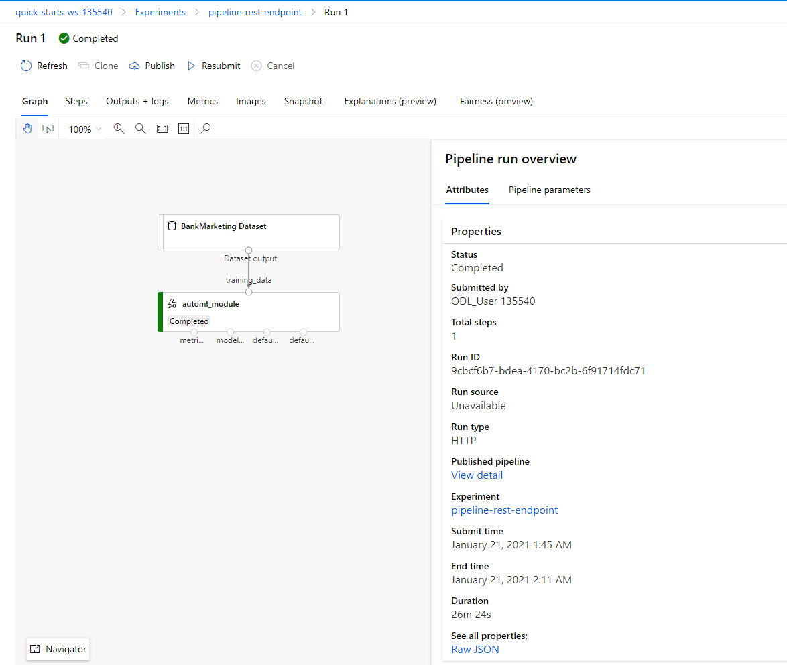

# Operationalizing Machine Learning in Azure
## Overview
This project is part of the Udacity Azure ML Nanodegree. In this project, we build and operationalize an Azure ML pipeline using Azure Machine Learning Studio and Azure ML Notebooks using Python SDK. 

In Azure Machine Learning Studio, an AutoML run is confugred for the given dataset. The AutoML Run identifies the best model using a defined metric such as accuracy or AUC ..etc. The best model is then deployed to Azure Container Instances(ACI) or Azure Kubernetes Instances(AKI). The deployment creates an endpoint, which can be inspected using Swagger. The end point can be managed using Python SDK. 

Using Azure ML Python SDK, the ML pipeline can be built, deploy, and consume in Azure ML notebooks. An AutoML run is configured using SDK and the AutoML run identifies best model. Deploying the model creates a HTTP service, which can be consumed by clients. The service endpoints can be managed using SDK. The endpoint can be inspected using swagger to understand the signature of the service and its request and response structures.

## Dataset Summary
The dataset contains data about marketing compaigns of bank. The label indicates whether the customer subcribed after the campaign. The goal is to build a classification model that predicts if the client will subscribe or not.  The data contains demographic information of the client such as age, job, marital status and education along with finacial information such as housing, loan. Each record for the customer contains information related to participation in previous campaigns, when he was last contacted ..etc.

## Architectural Diagram
The lifecycle of machine learning model invloves data acquisition, data preparation, hypothesis and model development, model evaluation, model deployment, operations and optimization of the model. Azure Machine Learning uses DevOps based MLOps(Machine Learning Opearations) approach for meaching leaning workflows. MLOps applies applies continuous integration, delivery and deployment to the nachine learning process. 

An Azure ML pipeline contain steps from data preparation to feature extraction to hyper parameter tuning to model evaluation. The Azure ML pipelines can be build, deployed and managed using Azure Machine Learning Studio UI. The Azure ML pipelines can be build, deployed and managed using Azure ML SDK.

## Key Steps
### Using Machine Learning Studio

Azure ML uses datasets to refer the data stored in datastore. The dataset can be created and peform data exploration before starting the Model development. Using Azurel ML studio, dataset can also be created during the AutoML configuration. The following screenshot shows the bank marketing dataset created during the AutoML configuration using Azure Machine learning Studio.

Using Azure Machine Learning Studio, an AutoML experiement can be started by selcted the AutoML and then configuring the type of machnine leaning and the dataset.The following screen shot shows the AutoML run and its status.

The following screenshot shows the details of the AutoML experiment. The AutoML run identifies Votingensemble as the best algorith and the correspoding mertic (accuracy: 0.91806). 

The following screenshot shows the details of the Voting Ensemble model run.

In Azure Machine Learning Studio, the best model can be deployed using the "Deploy" button on the model details of the above screenshot. Compute type and authentization can be configured during the deployment. The following screenshot shows the details of deploying a model.

Once the model is deployed, a REST endpoint is available for consumption. The following screenshot shows the deployment during the trnasitioning phase of the deployment.

The endpoints can be monitored using Python SDK. For example, the following screen shows a python script queries the logs of the endpoint. 

The REST endpoint can be inspected using swagger. Once the endpoint is deployed, Azure provides a Swagger JSON file, which can be used to host web server for metadata for the endpoint. The following screenshot shows Swagger UI showing details of the model.

Inspecting the methods on the Swagger UI shows the details of the web service methods and its request and response signatures.

The REST endpoints can be consumed using Python Code. The following screenshot shows the results of calling REST endpoint using Python code.

The endpoints can be benchamrked using ApacheBench.The following two screenshots shows detail of an benchmarking test.

### Using Python SDK

Using Azure Notebooks, an AutoML experiement can be crated by submitting a pipeline with AutoML steps/ .The following screen shot shows the pipeline run and its status.

The details of the pipelines contains the steps in the pipeline. The Graph shows the steps the in the pipeline/

Usning SDK, The datasets cab be created and registed with Azure ML. The following screenshot shows dataset created by the notebook.

After submitting the pipeline for run, RunDetails method shows the details of the run the notebook.

By calling wait_for_completion method, the notebook waits for pipeline run to complete and shows the details of the run. The following screenshot shows a completed status.

The pipeline can be published using SDK. The following screenshot shows the published endpoint.

The endpoint run can be examined in Azure Machine Learning Studio. The following screenshot shows the pipeline runs.

The following screenshot shows the details of the pipeline run.

The following screenshot shows the details of the pipeline run after completion.

## Screen Recording
*TODO* Provide a link to a screen recording of the project in action. Remember that the screencast should demonstrate:

## Standout Suggestions
The AutoML dataguard feature indicates that the data is imbalanced. the smallest class has 3692 rows where as the dataset contains 32950. Using undersampling or oversampling can improve the performance.

Including deep learning models may provide better results.

